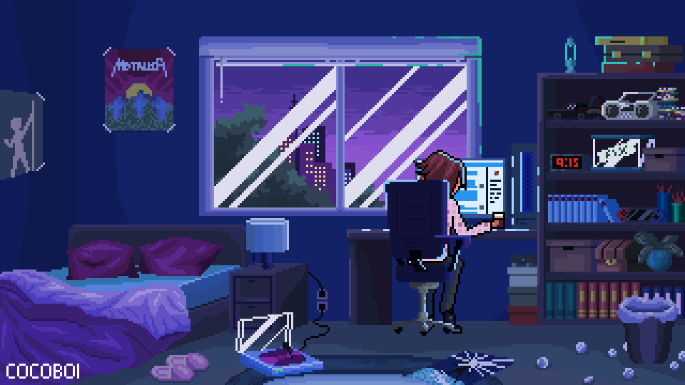

  

  <h1 align="center">Hi ,I'm Ankit Mohanty </h1>

  <

---

<h3> 👨🏻‍💻 &nbsp;About Me </h3>

- 🎓 &nbsp; B.Tech CSE student at SOA, ITER Bhubaneswar, focused on building impactful tech projects.  
- 🤖 &nbsp; Full-stack developer passionate about creating real-world solutions with modern tech stacks.  
- 🌱 &nbsp; Exploring backend systems, cloud technologies, AI integrations, and clean, intuitive UI design.  
- ⚡ &nbsp; Curious, proactive, and always eager to learn, innovate, and contribute to meaningful projects.

### 🛠️ Tech Stack

  <!-- Row 1 -->
  
   

  <!-- Row 2 -->
  

### I’ve worked on:

- 💻 Full Stack Development with **React + Node.js + MongoDB**
- 🔐 Secure Authentication using **JWT, Google OAuth**
- 🎨 Responsive UIs with **React + TailwindCSS**
- ⚡ REST APIs and CRUD backends in **Express.js**
- 🗄️ Database management with **MongoDB + MySQL**
- 🚀 Deployment on **Vercel, Netlify, Render**

### 🌟 Core Interests  

- ⚡ Backend Development with **Node.js + Express**  
- 🔐 Building Secure & Scalable **REST APIs**  
- 🛢️ Efficient Database Design using **MongoDB & MySQL**  
- 🤖 Integrating **Hugging Face APIs** to create AI-powered projects  
- 🚀 Deploying and Optimizing apps on **Vercel, Netlify, Render**  

<h3> 🤝🏻 &nbsp;Connect with Me: </h3>

⭐️ [Ankit Mohanty](https://github.com/Ankit-Mohanty-23/Ankit-Mohanty-23)
